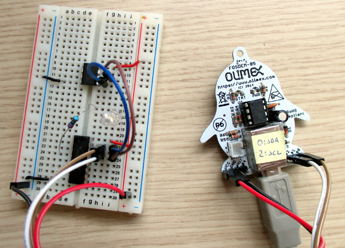

# i2c_tiny_usb for FOSDEM-85

This is a port of Till Harbaums'
[i2c_tiny_usb](http://www.harbaum.org/till/i2c_tiny_usb) firmware to
the [Olimex
FOSDEM-85](https://www.olimex.com/Products/Duino/AVR/FOSDEM-85/open-source-hardware)
board that was handed out at [FOSDEM'14](http://www.fosdem.org).

The corresponding host side Linux driver has been in mainline for many
years (CONFIG_I2C_TINY_USB), so with this you have easy access to the
normal kernel I2C infrastructure through your FOSDEM-85 board.

## Programming

The FOSDEM-85 board uses the nice
[micronucleus](https://github.com/micronucleus/micronucleus)
bootloader, so to upload this firmware simply connect the board to
your PC and run: `micronucleus firmware.hex`
```
> Please plug in the device ...
> Press CTRL+C to terminate the program.
> Device is found!
connecting: 40% complete
> Device has firmware version 2.3
> Device signature: 0x1e930b
> Available space for user applications: 6522 bytes
> Suggested sleep time between sending pages: 7ms
> Whole page count: 102  page size: 64
> Erase function sleep duration: 714ms
parsing: 60% complete
> Erasing the memory ...
erasing: 80% complete
> Starting to upload ...
writing: 100% complete
>> Micronucleus done. Thank you!
```

## Usage

Connect I2C device(s) to FOSDEM-85 board (SDA is pin 0, SCL is pin 2,
VCC/GND) and connect USB cable to PC:

```
# i2cdetect -l | grep tiny
i2c-9   i2c             i2c-tiny-usb at bus 003 device 003      I2C adapter

# i2cdetect -y 9
     0  1  2  3  4  5  6  7  8  9  a  b  c  d  e  f
00:          -- -- -- -- -- -- -- -- -- -- -- -- --
10: -- -- -- -- -- -- -- -- -- -- -- -- -- -- -- --
20: -- -- -- -- -- -- -- -- -- -- -- -- -- -- -- --
30: -- -- -- -- -- -- -- -- 38 -- -- -- -- -- -- --
40: -- -- -- -- -- -- -- -- -- -- -- -- -- -- -- --
50: 50 -- -- -- -- -- -- -- -- -- -- -- -- -- -- --
60: -- -- -- -- -- -- -- -- -- -- -- -- -- -- -- --
70: -- -- -- -- -- -- -- --

# i2cset -f -y 9 0x38 0xfe
# i2cset -f -y 9 0x38 0xff
```
(This is with a setup with a 24c64 eeprom and pcf8574a gpio extender).

Notice that the green led will flash for each I2C transaction as
debugging feedback.

Thanks to Till Harbaum for the original firmware and
[Olimex](http://www.olimex.com/) for the nice FOSDEM-85 board.


